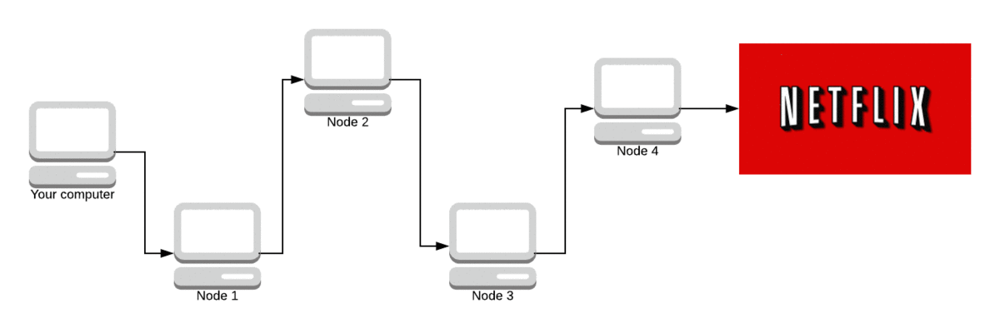

# MyTor

MyTor is an implementation of the [Tor Network](https://www.torproject.org) on JAVA's socket programming.

Provides an ObjectStream where objects passed through a network of 3 volunteer-based servers with layers of encryption such that none of the volunteers come to know about both the server and client and hence the communication remains anonymous.

## Technologies Used
* JAVA
* Hybrid Encryption - **RSA + AES**

## Onion Routing in TOR

